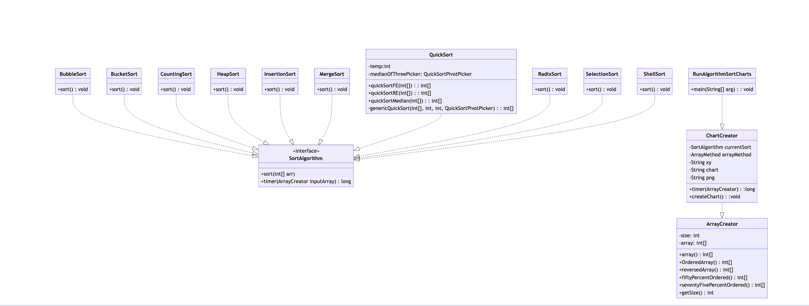

Our final analysis is the root directory towards the bottom between right below CONTRIBUTING.md on github but will be pushed down further if you're looking at it in inteliJ. 

This is a sorting algorithm experiment where we take various sorting algorithms
and run various iterations of various size arrays as input and create charts
that demonstrate the runtime in relation to array size.

To use this repository you will need the intelliJ IDE and also five dependencies
are required. First is Junit, second is JFree, the third is Jackson-core(2.18), fourth is Jackson-databind(2.18), and fith is npm package manager. To use JFree you will need
to add the .jar file as a dependency. The JFree .jar file can be found in this
link (https://mavenlibs.com/jar/file/org.jfree/jfreechart).



## Running

To run most tests go to src/main/java/Results/ there you will find the java files each containing a main function which you can run.

For QuickSortRunTests it has a dedicated local website, when you run the main it will open your browser and the folder containg the site as well as generate the data. Open the terminal in the website directory and run:

```bash
npm run install
npm run dev
```

Return to your browser and refresh the page, you will be prompted to browse to the outputed json which can be found in the root of the project folder
