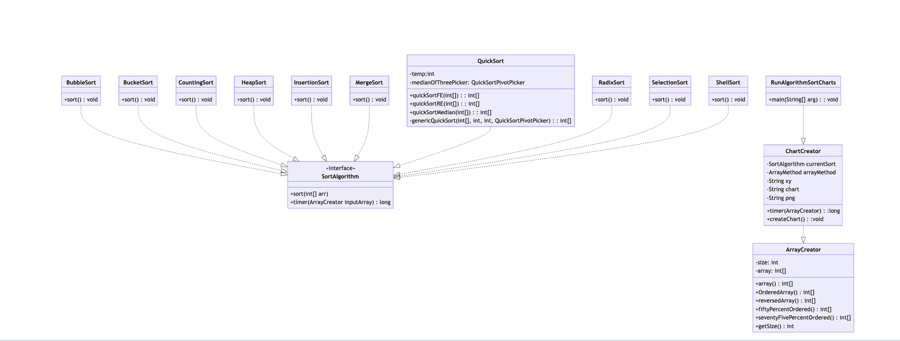

This is a sorting algorithm experiment where we take various sorting algorithms and run various iterations of various size arrays as input 
and create charts that demonstrate the runtime in relation to array size. 

To use this repository you will need the intelliJ IDE and also five dependencies
are required. First is Junit, second is JFree, the third is Jackson-core(2.18), fourth is Jackson-databind(2.18), and fith is npm package 
manager. To use JFree you will need to add the .jar file as a dependency. The JFree .jar file can be found in this
link (https://mavenlibs.com/jar/file/org.jfree/jfreechart).

## Running

To run most tests go to src/main/java/results/create.charts there you will find the java files each containing a main function which you can run.

For QuickSortRunTests it has a dedicated local website, got to src/main/java/results and open QuickSortRunTests, when you run the main it will open your browser and the folder containing the site as well as generate the data. Open the terminal in the website directory and run:

If you already have NodeJS installed on your computer, run the code below in your terminal and skip to the very last line at the bottom of this file. 

npm run install

npm run dev

------------------------------------------------------------------------------------------------------------------------
If you do not have NodeJS installed on your computer then find your operating system below and follow the commands in your terminal

For mac if you have homebrew installed:

brew install node

For mac if you do not have homebrew installed:

got to https://nodejs.org/en and click on download

Ubuntu or other Debian based OS:

sudo apt update

sudo apt install nodejs npm

CentOS (or other Red Hat-based systems):

sudo yum install epel-release

sudo yum install nodejs npm

Windows:

winget install OpenJS.NodeJS

After installation run this code to verify your installation:

node -v

npm -v

------------------------------------------------------------------------------------------------------------------------
Return to your browser and refresh the page, you will be prompted to browse to the rendered json which can be found in the root of the project folder
